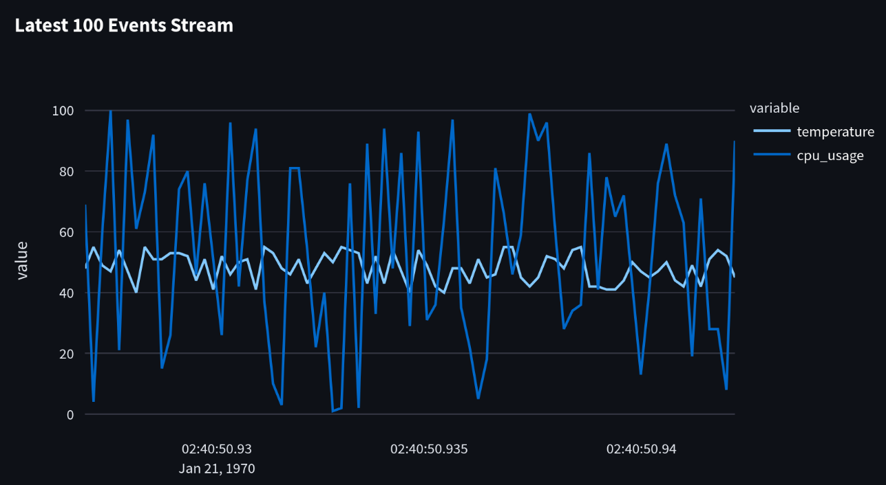

# Streamlit

[This code sample](https://github.com/quixio/quix-samples/tree/main/python/others/streamlit) 
demonstrates how to run a Streamlit dashboard that displays data.

It connects to a websocket endpoint and shows the latest N records (based on timestamp) 
as a line graph, where each column has its own line.



## How to run

Create a [Quix](https://portal.platform.quix.io/signup?xlink=github) account or log-in and visit the Samples to use this project.

Clicking `Deploy` on the Sample, deploys a pre-built container in Quix. Complete the environment variables to configure the container.

Clicking `Edit code` on the Sample, forks the project to your own Git repo so you can customize it before deploying.

## Requirements/Prerequisites

### Websocket
This application assumes you are connecting to some websocket that allows
selecting stream keys through the path, ex: `ws://my-socket-url/a_key`.

This example also assumes the websocket requires authentication.

It is recommended you use this alongside the [Quix Websocket Destination](https://github.com/quixio/quix-samples/tree/main/python/destinations/websocket),
which provides these features.

### Data
This example assumes a data structure like:
```python
{"temperature_c": 54, "cpu_usage_percent": 51, "timestamp": 1737612795.0035408}
```

## Using the Dashboard

Once the Application is running, navigate to the endpoint noted in the console in 
a browser.

There will be several fields to configure; then, hit the `Start!` button, which begins
the visualization.

> Note: When finished, be sure to hit the `Stop` button before closing the browser tab!

## Contribute

Submit forked projects to the Quix [GitHub](https://github.com/quixio/quix-samples) repo. Any new project that we accept will be attributed to you and you'll receive $200 in Quix credit.

## Open source

This project is open source under the Apache 2.0 license and available in our [GitHub](https://github.com/quixio/quix-samples) repo.

Please star us and mention us on social to show your appreciation.
