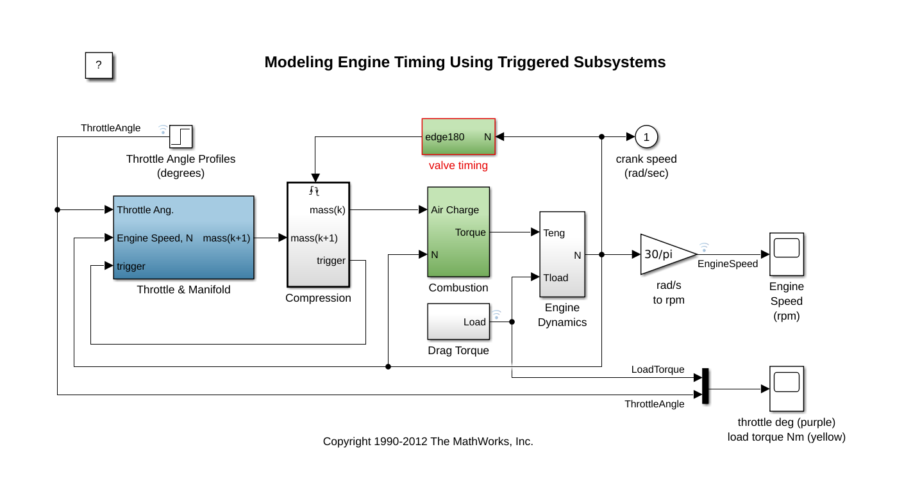

# Simulink

Use this template to deploy Simulink models to Quix. Upload your *.slx files containing Simulink model with any other assets required to run the model to the MATLAB directory of this project. Use MATLAB workspace variables send input signals based on Quix Streams to the simulink model and receive output signals. The best way to do this is write a simple MATLAB function like `engine.m` in the example that receives input data from Python, set a workspace variable, call the simulink model return output result to a MATLAB workspace variable. 

This project template contains a modified version of [simulation of a four-cylinder spark ignition internal combustion engine](https://www.mathworks.com/help/simulink/slref/modeling-engine-timing-using-triggered-subsystems.html) by MathWorks. Refer to the diagrams below to compare key differences between the IO components of the two models. The signals for throttle angle, load torque and engine speed have been converted to workspace variables:

  
   

 - [Call MATLAB functions from Python](https://www.mathworks.com/help/matlab/matlab-engine-for-python.html?s_tid=CRUX_lftnav)
 - [MATLAB Arrays in Python](https://www.mathworks.com/help/matlab/matlab_external/matlab-arrays-as-python-variables.html)
 - [Pass data to MATLAB](https://www.mathworks.com/help/matlab/matlab_external/pass-data-to-matlab-from-python.html)

**It is recommended that you deloy MATLAB engine with at least 2 CPU and 4GB memory.**

## Requirements
 - A license server that is accessible from the Quix environment.
 - MATLAB and Simulink concurrent license.

## Build variables

 - To start MATLAB engine you must set the MLM_LICENSE_FILE environment variable to your license server port and URL in the `build/dockerfile` file (line 23). E.g., `MLM_LICENSE_FILE=27000@0.0.0.0`.

## Environment variable
 - `INPUT_TOPIC`: Kafka topic to receive input data from.
 - `OUTPUT_TOPIC`: Kafka topic to write the results of the transformation.
 - `MLM_LICENSE_FILE`: License server port and address. E.g., 27000@hostname_or_ip_addr.